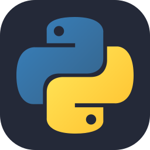
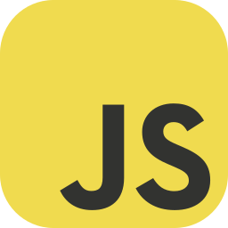
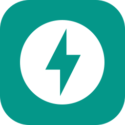
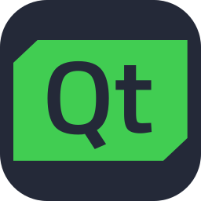
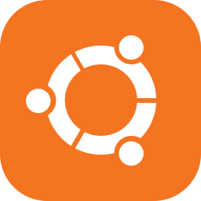
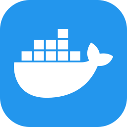
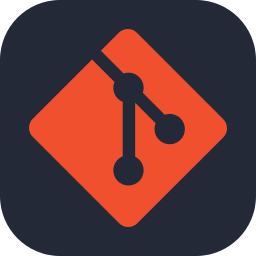

<h1 align="center">Raven</h1>

  <strong>Computer Engineering Student</strong>
  -
  <strong>Python Developer</strong>

  <a href="https://github.com/Rav3n48">GitHub</a>
  -
  <a href="https://t.me/HES4M88">Telegram</a>
  -
  <a href="https://instagram.com/raven_developer">Instagram</a>

---

I'm **Hesam**, but in the tech world I go by **Raven**.

I'm a Computer Engineering student focused on **Python and backend development**. I enjoy building software, understanding how systems work under the hood, and exploring technologies that make developers more productive.

## Tech Stack

### Languages

  
  

### Frameworks & Libraries

  
  
  
  

### Tools & Technologies

  
  
  
  
  

## What I Build

- Backend applications and APIs
- Developer tools and automation
- Software with a focus on clean architecture and maintainability

## Currently Exploring

- Advanced **JavaScript**
- **AI and Machine Learning**

## Contact

